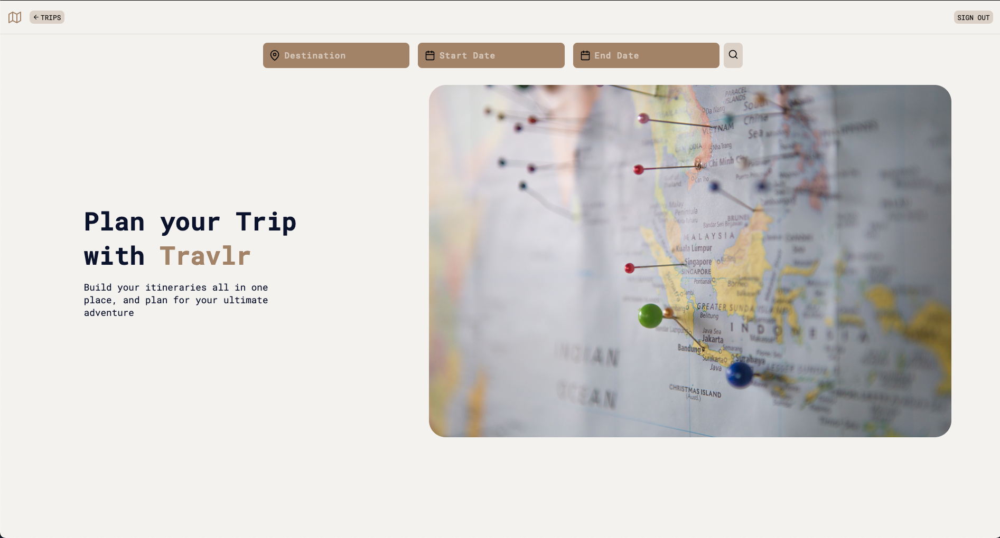
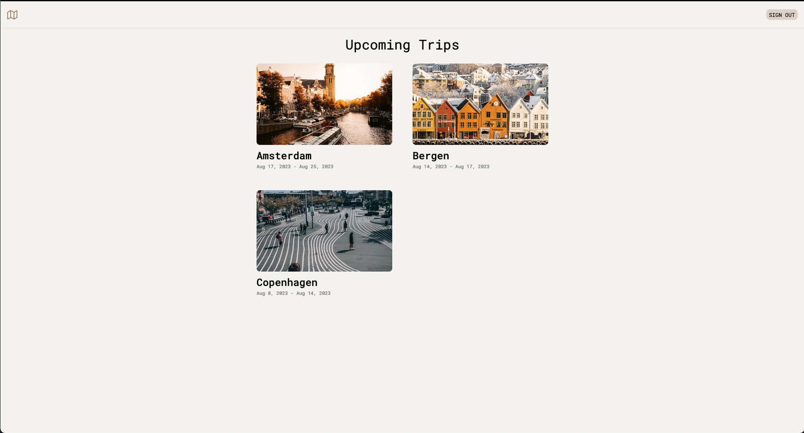
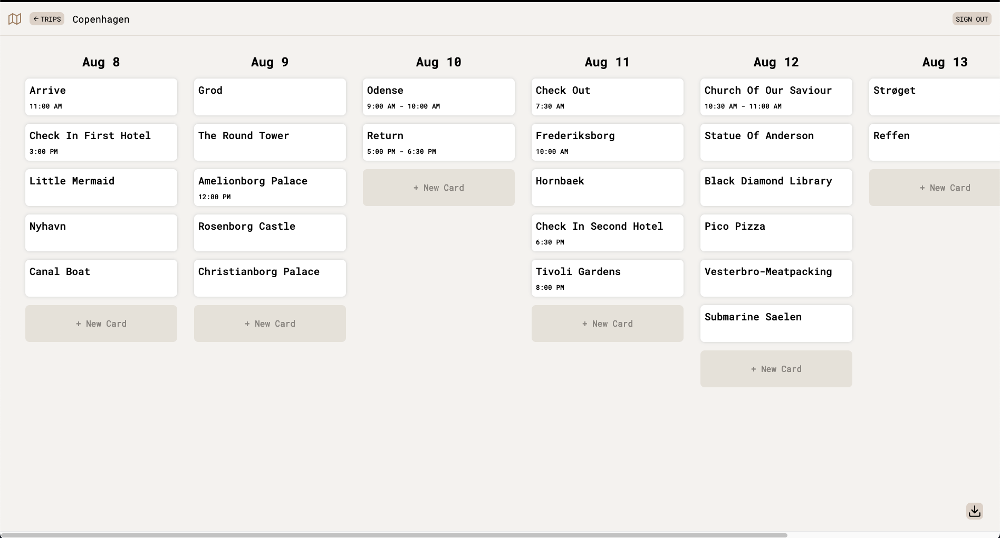

# Travlr

## Demo Link

You can access my website [here](https://travlr-9c098.web.app/)

Demo login information:

- Email: `demo@demo.demo`
- Password: `demo123`

## Technologies

- React
- TypeScript
- HTML
- CSS
- Firebase
- Unsplash API
- Foursquare API

## About The Website

I decided to make a travel itinerary website because I am going on a 2 week
northern Europe trip in August 2023. The purpose of this website was to provide
a way for me to easily manage all my itineraries. I made a login feature so multiple
people can use the website at the same time without changing each others itineraries.

## Screenshots

## Roadmap

- [x] Add a drag feature to move the activities around.
- [x] Make a feature to download the itinerary as a PDF.
- [x] Use the Places API to have a autocomplete for destinations. (I used the FOURSQUARE API instead.)
- [x] Get better at UI/UX design so I can make the app look better.

## License

Distributed under the MIT License. See `LICENSE` for more information.
